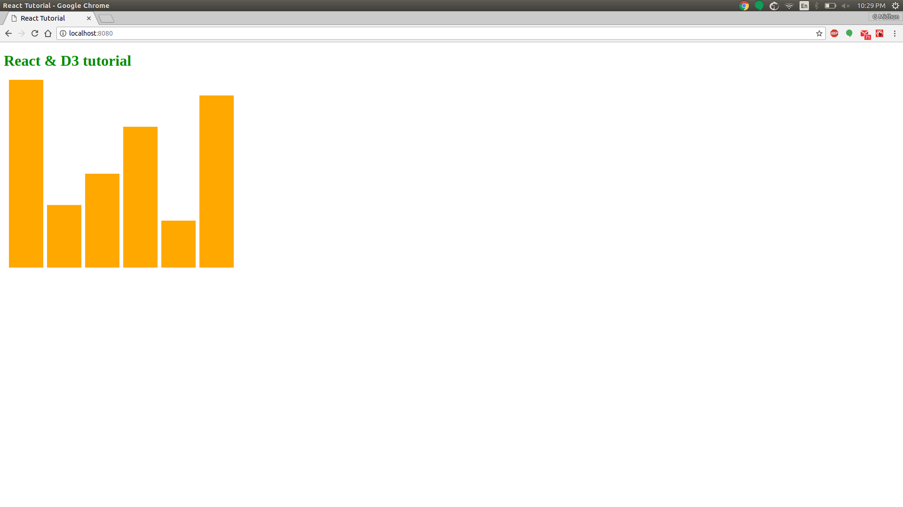

# React+D3 Tutorial

This project is a beginner level tutorial to setting up a react app. We will also look into developing a simple bar chart with D3.

## Requirements

For development, you will need Node.js installed on your environement. Then we will use npm to get React and D3.

### Node

[Node](http://nodejs.org/) is really easy to install & now includes [NPM](https://npmjs.org/).

#### Node installation on OS X

    brew install node

#### Node installation on Linux

    curl -sL https://deb.nodesource.com/setup_9.x | sudo -E bash 
    sudo apt-get install nodejs
    sudo apt-get install build-essential

You should be able to run the following command after the installation.

    $ node -v
    v9.10.1

    $ npm -v
    5.8.0

### React

Now that you have node installed in your system. Lets start a node project.

    mkdir reactProject
	cd reactProject
	npm init

Terminal prompt requests for information about your project. You can just skip through by pressing enter, if you wish to add information about your project you can do so. This will generate a package.json file.


#### Setting up react and babel

Now run the follwing commands to add react and babel as dependencies to the project. We will also install webpack to bundle our code into a single js file and webpack-dev-server to run a development server.

	npm install --save react react-dom
	npm install --save-dev babel-core babel-loader babel-preset-env babel-preset-react
	npm install --save-dev webpack webpack-cli webpack-dev-server

Now that we installed babel we need to configure the react app to use babel. Add the following config in the package.json file

	"babel": {
	    "presets": [
	      "env",
	      "react"
	    ]
	  },

Now we need to configure webpack to make you of babel-loader and output a bundle.js file. Create a file webpack.dev.config.js and define a entry point, loaders that are responsible to turing the code into single js file, output path for the bundle and options for the dev server.

	var webpack = require('webpack');
	var path = require('path');

	var parentDir = path.join(__dirname, '/');

	module.exports = {
	    entry: [
	        path.join(parentDir, 'index.js')
	    ],
	    module: {
	        rules: [{
	                test: /\.(js|jsx)$/,
	                exclude: /node_modules/,
	                use: {
	                    loader: 'babel-loader'
	                }
	            }
	        ]
	    },
	    output: {
	        path: parentDir + '/dist',
	        filename: 'bundle.js'
	    },
	    devServer: {
	        contentBase: parentDir,
	        historyApiFallback: true
	    }
	}


Now lets create our index.html and index.js which is the entry point for our webpack server. Create two files index.html and index.js in the root folder.

	<!DOCTYPE html>
	<html>
	    <head>
	        <title> React Tutorial </title>
	    </head>
	    <body>

	        <div id="app"></div>
	        <script type="text/javascript" src="/bundle.js"></script>
	        <script src="https://d3js.org/d3.v5.min.js" charset="utf-8"></script>
	    </body>
	</html>

You can see in the index.html code our code will be mounted inside ```html <div id="app"></div> ```. And you can see in the index.js file below, our App will be mounted inside element with id "app".

	import React from 'react';
	import ReactDOM from 'react-dom';
	import App from './containers/App';

	ReactDOM.render(<App />, document.getElementById('app'))

For the final step of the setup, we will create a componen that will be mounted on the homepage of the server.

	mkdir containers
	cd container
	touch App.js

Add the following code to the App.js file create. The App component simply return header that has some text.

	import React, {Component} from 'react';

	class App extends Component {
	    render () {
	        return (
	        		<h1 style={{color:"green"}}>React & D3 tutorial</h1>
	        );
	    }
	}

	export default App;

Add the following script to package.json to let webpack know where the config file is and to run.

	"scripts": {
	  "test": "echo \"Error: no test specified\" && exit 1",
	  "dev": "./node_modules/.bin/webpack-dev-server --mode development --config ./webpack.dev.config.js"
	}

Finally run the command below to start the server and you will be able to see the app working on http://localhost:8080 

	npm run dev

## Creating a Bar-Chart

### creating a bar

create a folder components, then we will create our first component i.e., a rectangle for the bar chart.

	mkdir components
	cd components
	touch Rectangle.js

Write the following code to the file. Which receives props from a parent component and creates a rectangle from those specifications.

	import React, { Component } from 'react'

	class Rectangle extends Component {
		render() {
			return ( <rect width={this.props.width} height={this.props.height} x={this.props.x} y={this.props.y} fill="orange"/> );
		}
	}

	export default Rectangle;

Also modify the App.js as below to send props to the child components and render the child component.

	import React, {Component} from 'react';
	import Rectangle from '../components/Rectangle'

	class App extends Component {
	    render () {
	        return (
	        	<div>
	        		<h1 style={{color:"green"}}>React & D3 tutorial</h1>
	        		<svg height="500" width="500">
	        			<Rectangle height="30" width="150" x="30" y="30"></Rectangle>
	        		</svg>
	        	</div>
	        );
	    }
	}

	export default App;

You can see by running the app a rectangle in the browser.


### creating bar chart

Let us now install d3 using npm.

	npm install --save d3

We add a new component BarChart in the components folder. Create the file BarChart in components folder and add the following code.

	import React, { Component } from 'react'
	import Rectangle from "./Rectangle"
	import * as d3 from 'd3'

	class BarChart extends Component {

		constructor(props){
			super(props)
			this.state = {
				data: [300,100,150,225,75,275],
				width: 500,
				height: 400
			}
		}

		render() {

			var props = this.state;

		    var y_scale = d3.scaleLinear().domain([0, d3.max(this.state.data)]).range([0, this.state.height]);

		    var x_scale = d3.scaleBand().domain(d3.range(this.state.data.length)).rangeRound([0, this.state.width]).padding(0.1);

		    var bars = this.state.data.map(function(point, i) {
		      var height = y_scale(point),
		          y = props.height - height,
		          width = x_scale.bandwidth(),
		          x = x_scale(i);
		      return (
		        <Rectangle height={height} 
		              width={width} 
		              x={x} 
		              y={y} 
		              key={i} />
		      )
		    });

			return ( 
					<div>
						<svg width={this.state.width} height={this.state.height}>
							{bars}
						</svg>
					</div>
				);
		}
	}
	export default BarChart;

The code simply generates a Rectangle component for each datapoint and renders those bars. We will now refactor App.js into rendering BarChart instead of a rectangle and you can see the result below.

	import React, {Component} from 'react';
	import BarChart from '../components/BarChart'

	class App extends Component {
	    render () {
	        return (
	        	<div>
	        		<h1 style={{color:"green"}}>React & D3 tutorial</h1>
	        		<BarChart></BarChart>
	        	</div>
	        );
	    }
	}

	export default App;



We will now add two buttons in the BarChart "Add" and "Remove". As the names indicate the "Add" button will add a random element and the "Remove" button will remove the last element of the BarChart. Make adjustments to the BarChart.js as below.

	constructor(props){
		super(props)
		this.state = {
			data: [300,100,150,225,75,275],
			width: 500,
			height: 400
		};
		this.addElement = this.addElement.bind(this);
		this.removeElement = this.removeElement.bind(this);
	}

	addElement(event){
		this.setState({ 
		  data: this.state.data.concat([Math.floor(Math.random()*300)])
		});
	}

	removeElement(event){
		this.setState({ 
		  data: this.state.data.slice(0,-1)
		});
	}

	render() {
		........

		return ( 
				<div>
					<svg width={this.state.width} height={this.state.height}>
						{bars}
					</svg>
					<p id="Add" onClick={this.addElement}>Add</p>
					<p id="Remove" onClick={this.removeElement}>Remove</p>
				</div>
			);
	}


## References

https://codeburst.io/setting-up-a-react-project-from-scratch-d62f38ab6d97


---
